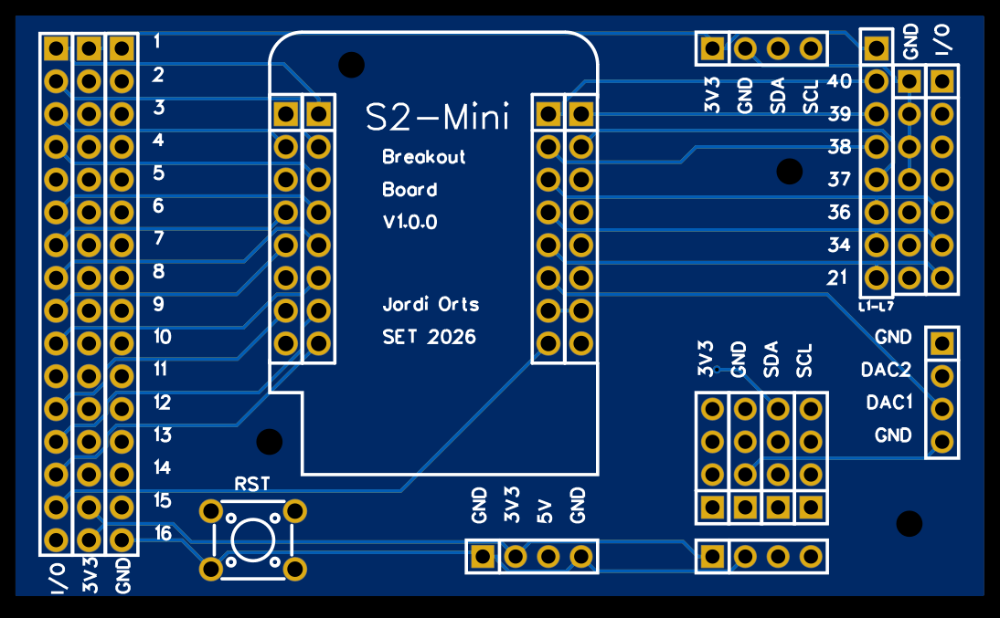

# S2miniBreakoutBoard
Breakout Board for Lolin S2 mini from wemos.cc

You can 3D print [this STL](STL/soldarS2miniBreakout.stl) for easy soldering. 

I2C slave firmware included with examples of master code in Arduino and micropython

* Easy access to all exposed pins of the S2 mini
* I2C bus connector

## Slave mode

* Arduino firmware. [Micropython](I2Cslave/master/micropython/ejemplo.py) and [Arduino](https://github.com/jorts64/S2MiniSlave/blob/main/examples/Basic/Basic.ino) master examples avalaible.
* [Arduino library](https://github.com/jorts64/S2MiniSlave)
* 16 I/O you can set individually as INPUT, INPUT_PULLUP, OUTPUT, PWM or ADC
* 2 DAC outputs
* I2C address by jumper configuration, you can choose any I2C address. You can chain up to 128 S2 mini I2C slave devices, if you ignore protocol restrictions [i2c address list: the 0x00–0x77 map](https://i2c.net/i2c-addresses/), so you could get 2048 configurable GPIO and 256 DAC inputs !!
* Really cheap device, about $10 S2 mini included. You can order PCB from JLCPCB and buy electronic components at Aliexpress.

## Hardware restricctions

As this board uses S2 mini microcontroller:

* DAC2 will give you error voltages because it's connected internally with a 10k pullup. You can improve the output with a R load [ESP32-S2 DAC2 Requires Load Resistor? ](https://github.com/espressif/arduino-esp32/issues/9324?utm_source=chatgpt.com)
* PWM are limited to 8 GPIO.
* ADC witn GPIO15 will give bad results. This GPIO is internally connected to the LED builtiin.
* ADC 11-16 don't be avalaible if WiFi is enabled. Neither DAC1 and DAC2. But they still can be used as INPUT, INPUT_PULLUP, OUTPUT or PWM with WiFi enabled.

